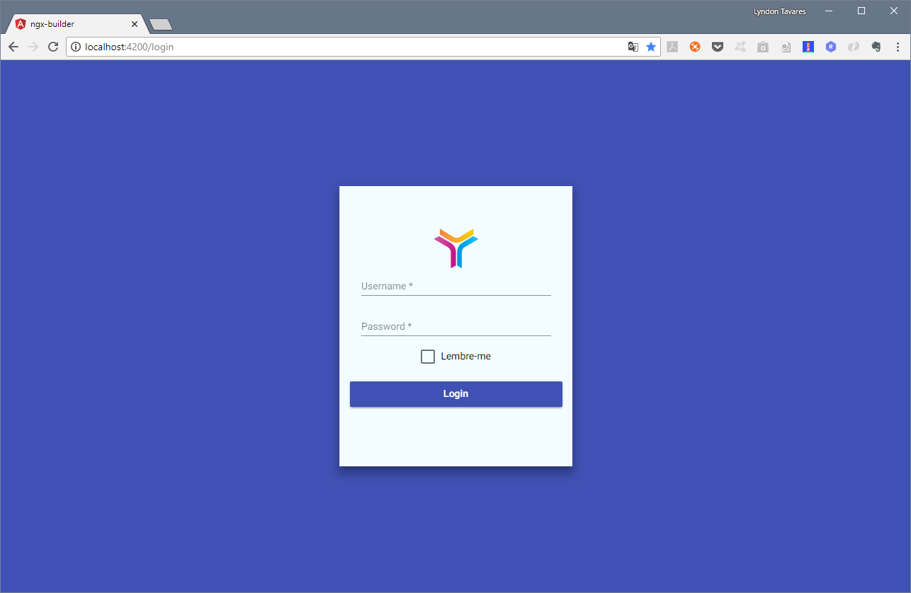
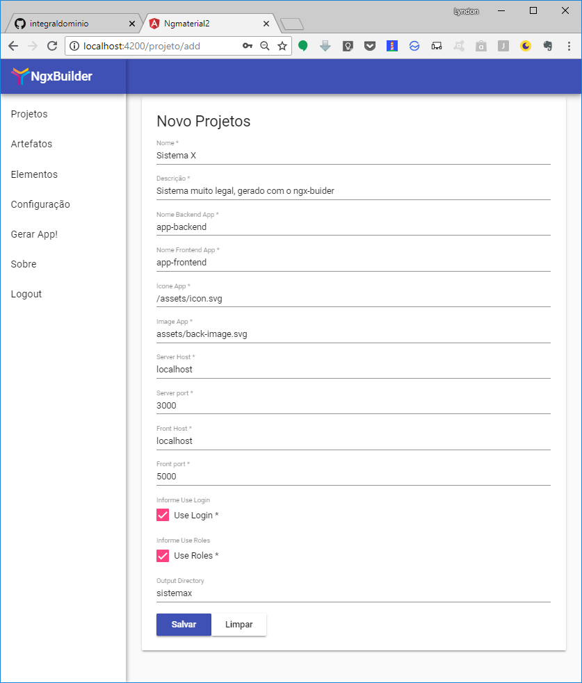
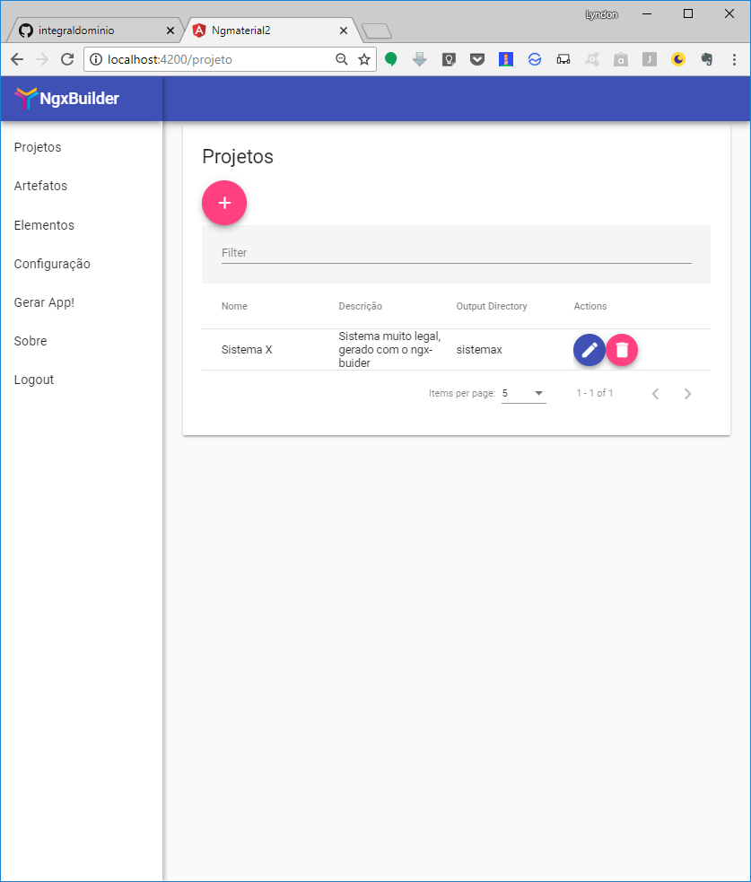
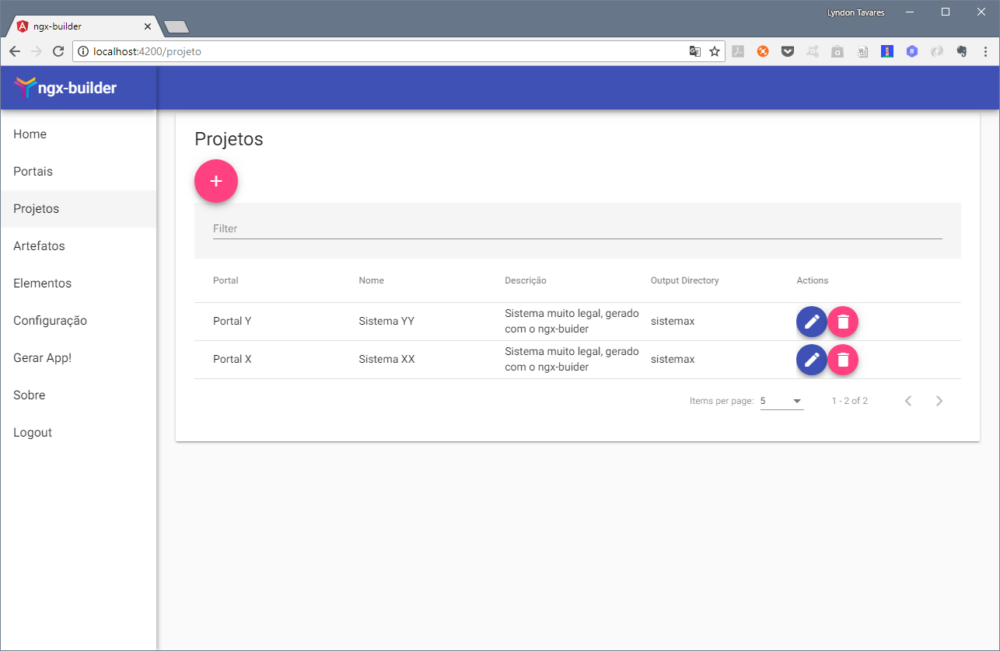
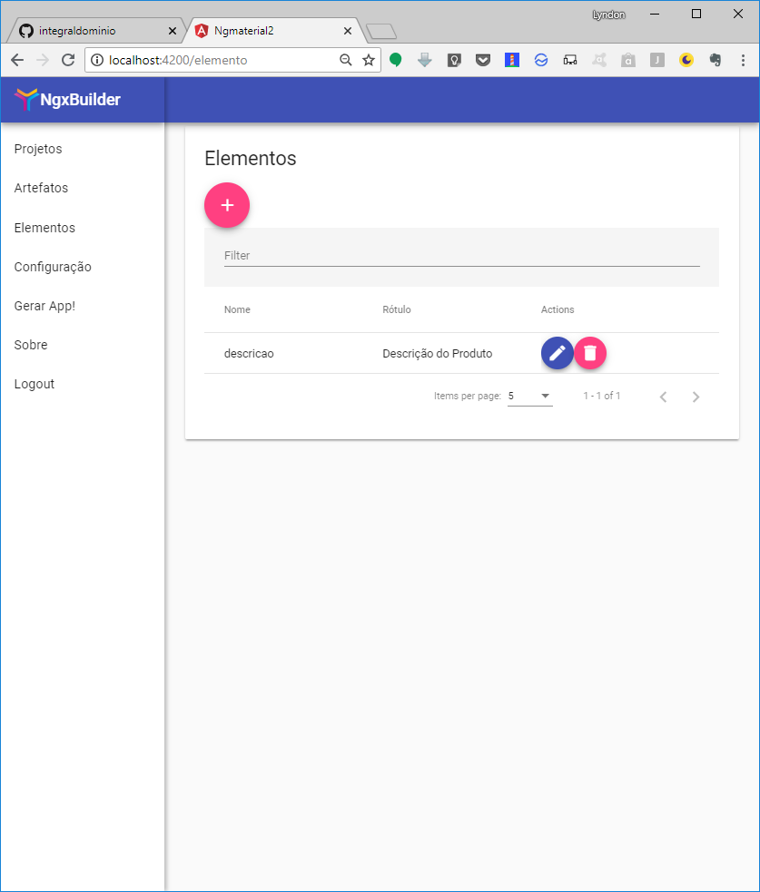
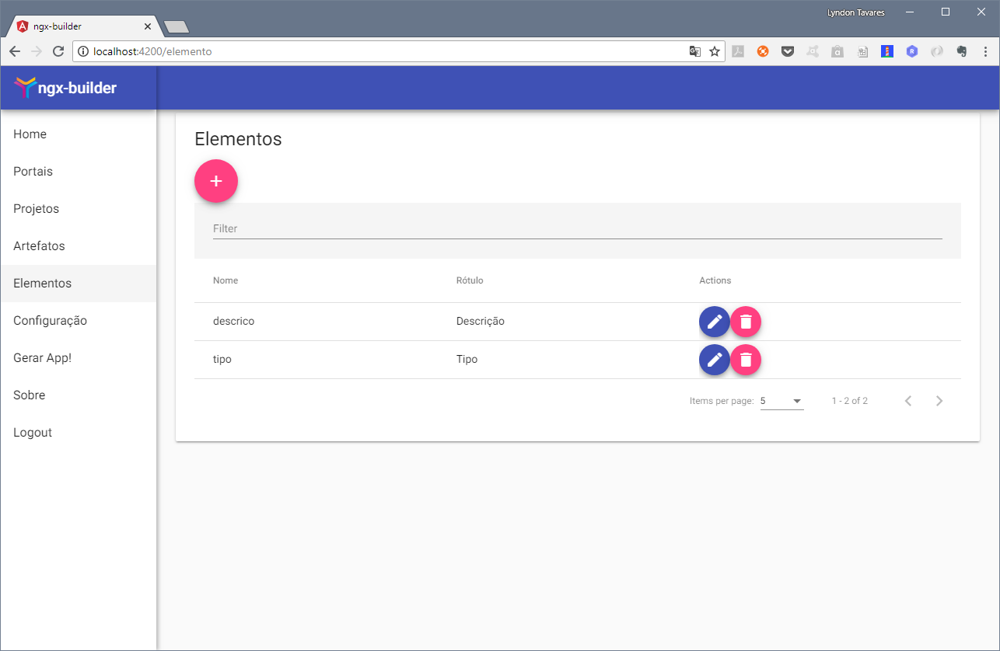
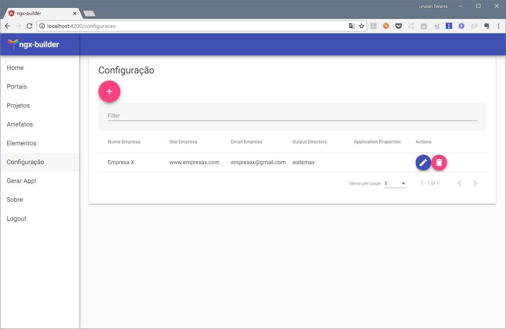
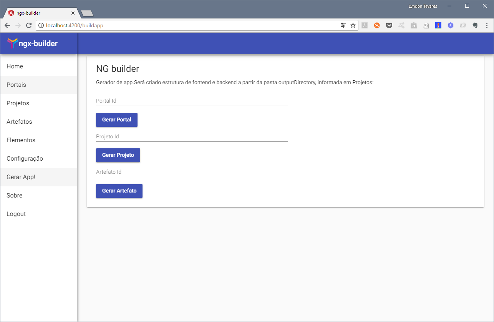
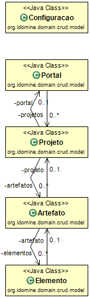

# NGX-Builder v 0.0.2

## ngx-builder

Construtor de aplicativos usando template engine FreeMaker, Spring Boot e Angular 6. 

## Pré-requisitos

* IDE Java Eclipse (http://www.eclipse.org/)
* Lombok (https://projectlombok.org/download)
* Visual Code (https://code.visualstudio.com/download)
* NodeJS (https://nodejs.org/en/download/)
* MySql (https://www.mysql.com/downloads/)

## Instalação

### Passo 1

Clone o repositório:
```
git clone https://github.com/integraldominio/ng-builder-api.git
```
### Passo 2

Importe o projeto Maven com IDE Java.

### Passo 3

Crie o database ngxbuilder no MySql. Configure usuário e senha nos profiles 

#### Selecione do profile

```
-Dspring.profiles.active=dev
-Dspring.profiles.active=prod
```

#### application-prod.properties:

```
spring.datasource.username=root
spring.datasource.password=1234
```

#### mysql command line:

```
mysql -uroot -p1234
create database ngxbuilder;
```

### Passo 4 

Prepare o profile de produção (applicaiton-pro.properties) em run configurations. IDE Eclipse.

### Passo 5

Gere o frontend do ngbuilder, executando GenerationBackendFrontend.java

### Passo 6 

Abrir projeto Angular em output/frontend usando Visualcode (sugestão).
Abrir terminal.
execute:

```
npm i
ng serve --o
```

Acesso: 
```
usuário: admin
senha: admin
```

## Frontend Ngx-Builder

Módulos:

### Login



### Dashboard



### Portal:



### Projeto:



### Artefato:



### Elemento:



### Configurações:



### Gerar App:




## Backend - Spring Boot

### Diagrama de classes



## Backend - Express

## Frontend - Angular 6


## Freemaker
https://freemarker.apache.org/

Tecnologias:

* Angular 6
* Springboot

# License
```
MIT License

Copyright (c) 2018, Lyndon Tavares (integraldominio@gmail.com)

Permission is hereby granted, free of charge, to any person obtaining a copy
of this software and associated documentation files (the "Software"), to deal
in the Software without restriction, including without limitation the rights
to use, copy, modify, merge, publish, distribute, sublicense, and/or sell
copies of the Software, and to permit persons to whom the Software is
furnished to do so, subject to the following conditions:

The above copyright notice and this permission notice shall be included in all
copies or substantial portions of the Software.

THE SOFTWARE IS PROVIDED "AS IS", WITHOUT WARRANTY OF ANY KIND, EXPRESS OR
IMPLIED, INCLUDING BUT NOT LIMITED TO THE WARRANTIES OF MERCHANTABILITY,
FITNESS FOR A PARTICULAR PURPOSE AND NONINFRINGEMENT. IN NO EVENT SHALL THE
AUTHORS OR COPYRIGHT HOLDERS BE LIABLE FOR ANY CLAIM, DAMAGES OR OTHER
LIABILITY, WHETHER IN AN ACTION OF CONTRACT, TORT OR OTHERWISE, ARISING FROM,
OUT OF OR IN CONNECTION WITH THE SOFTWARE OR THE USE OR OTHER DEALINGS IN THE
SOFTWARE.
```

